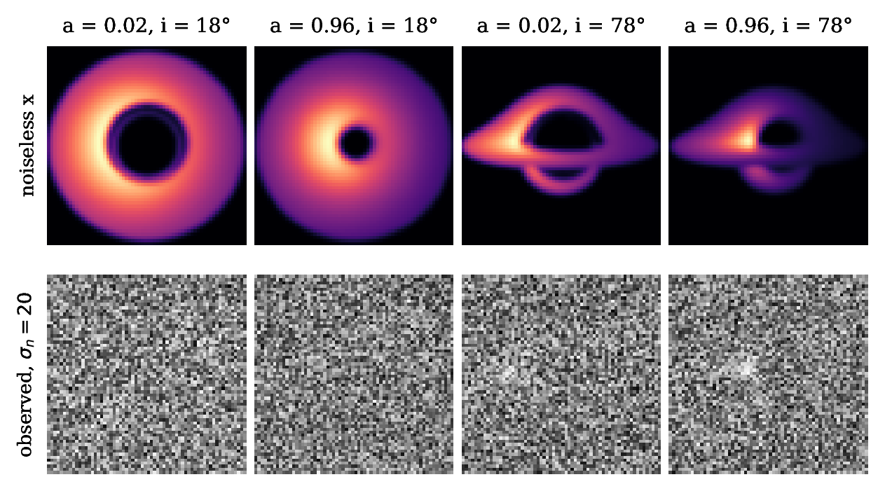
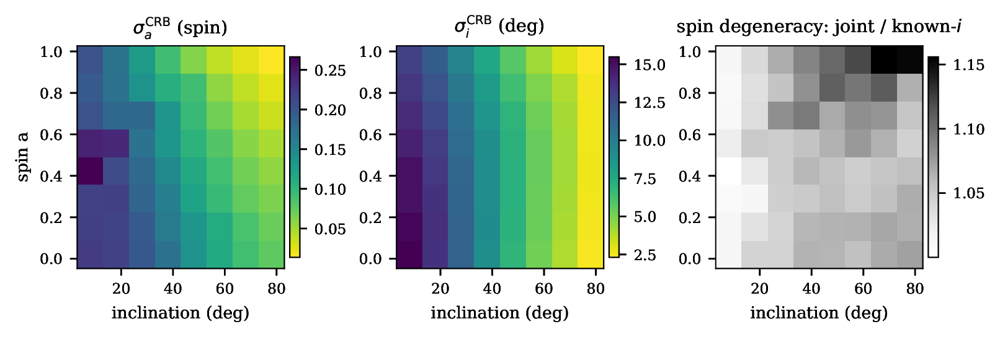
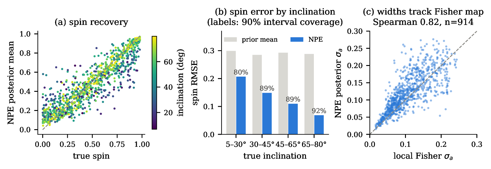
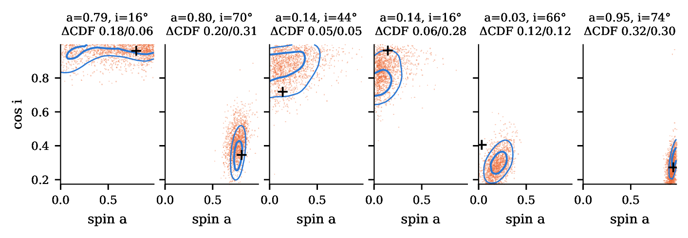

# kerr-sbi

**How much can a black-hole image tell us about spin?**

`kerr-sbi` studies what noisy images of a thin accretion disk can reveal about Kerr
black-hole spin and viewing inclination. We generate synthetic training data with
[nullgeo](https://github.com/James-Wirth/nullgeo), learn an amortized neural posterior,
and compare its predictions with Fisher-information estimates and explicit-likelihood
reference posteriors.

The first experiments show that the network extracts useful information even from
very noisy images. They also expose an important physical dependence: **much of the
spin signal comes from assuming that the disk reaches the innermost stable circular
orbit (ISCO).** Learning the simulator is only part of the problem; understanding
which assumptions make spin measurable is equally important.



*Preprocessed 64 × 64 images from nullgeo. Increasing spin moves the ISCO inward;
increasing inclination reveals stronger beaming and lensing structure. The bottom
row adds the adopted Gaussian noise, σₙ = 20. Each row uses an asinh display stretch.*

This is a research work in progress, using a controlled synthetic observation model.
The results below summarize the [first report, 26 September 2026](assets/research/status-report-2026-09-26.pdf),
with the training-seed follow-up from 27 September. Final population calibration and
inference on real observations remain open.

## From ray tracing to a posterior

Synthetic data make the physical assumptions explicit and testable. For each sampled
spin and inclination, nullgeo traces the image; a shared observation model then
applies blur, flux normalization and noise. The resulting images and known parameters
train a conditional density estimator. Once trained, the same network can infer a
posterior for a new observation without repeating a parameter-space likelihood scan.

The baseline model is deliberately small:

| Component | Assumption |
|---|---|
| Inferred parameters | Dimensionless spin **a ∈ [0, 0.98]** and inclination **i ∈ [5°, 80°]** |
| Prior | Uniform in a and in cos i; prograde disks |
| Scene | M = 1, camera distance 85 M, 22° field of view, black background |
| Disk | Geometrically thin; inner edge at the ISCO, outer edge at 15 M |
| Emission | Achromatic stylized intensity proportional to g³(r/rᵢₙ)⁻², with redshift factor g |
| Rendering | nullgeo 0.2.0, 64 × 64 pixels, fixed 9 × 9 rays per pixel |
| Inference | Five-layer CNN → 64-dimensional embedding → six-layer conditional spline flow |

The observation pipeline is part of the scientific model:

1. Read **linear floating-point PFM**, orient rows top-down, and convert RGB to luminance
   with weights (0.2126, 0.7152, 0.0722).
2. Apply a zero-padded 7 × 7 Gaussian PSF with σ = 1 pixel.
3. Normalize total flux to 4096, giving a mean pixel value of 1. Absolute brightness
   is discarded.
4. Add independent Gaussian noise with σₙ = 20, freshly sampled in each training batch.
5. Feed the network `asinh(x_obs / s)`, with s = 0.1 times the training-set median
   peak pixel value. This transform is invertible.

The estimator is implemented in JAX, Equinox and FlowJAX. The flow models
logit-transformed, standardized (a, cos i), and maps samples back to physical
parameters. Implementation: [observation model](src/kerr_sbi/obs_model.py),
[neural estimator](src/kerr_sbi/model.py), and [configuration](configs/default.toml).

## What the experiments show

### Inclination strongly controls spin sensitivity

The deterministic renderer and Gaussian noise give an explicit likelihood,
log L(θ) = −‖y − f(θ)‖² / (2σₙ²) + constant, where f is the blurred,
flux-normalized image. Finite differences of f give the local Fisher matrix
F = JᵀJ / σₙ².



*Local Cramér–Rao bounds on an 8 × 8 parameter grid at σₙ = 20. Lighter colors
in the first two panels indicate tighter bounds; the third measures local coupling
between spin and inclination.*

Spin bounds range from **0.014 to 0.266**, compared with a prior standard deviation
of 0.283. Inclination bounds range from **2.3° to 15.5°**. Both improve toward high
inclination, while local spin–inclination coupling is modest: knowing inclination
improves the spin bound by at most a factor of 1.16 on this grid.

These are local, finite-difference estimates. Checks at selected ISCO-model locations
and step sizes support this map; they do not establish continuum derivatives or make
Fisher bounds equivalent to Bayesian posterior widths.

### A small neural estimator learns useful image information

The original pilot used 2,000 synthetic images: **1,800 for fitting and 200 for
validation**. Training took about six minutes on a laptop CPU, excluding rendering.
Evaluation used **1,000 independent development observations**, with 1,999 posterior
draws per observation.

| Development metric | Spin a | Inclination i |
|---|---:|---:|
| Posterior-mean RMSE | 0.128 | 7.37° |
| Prior-mean baseline RMSE | 0.284 | 17.4° |
| Coverage of 90% equal-tailed intervals | 88.5% | 91.1% |
| Correlation of posterior width with Fisher bound¹ | 0.82 | 0.79 |

¹ Spearman correlation, using the 914 observations within the Fisher grid.

Mean negative log density falls from **2.848 for the prior to 0.898 for the network**:
a gain of **1.95 nats per observation**. These densities are measured in the flow's
transformed parameter coordinates. Shuffling image–parameter pairs raises NLL to
7.27 on the first 200 observations, supporting the conclusion that the estimator
uses image information.



*The original pilot's development results. Spin RMSE falls from about 0.21 at
5–30° inclination to 0.068 at 65–80°. Face-on estimates shrink toward the prior mean;
high-inclination images constrain spin much more sharply.*

Near-nominal global coverage does not establish final calibration. The 80% spin
coverage in the face-on bin is a diagnostic target, but truth-conditioned coverage
need not be nominal even for an exact Bayesian posterior. The reserved final test
split has not been generated or used.

### Explicit-likelihood references reveal remaining approximation error

A 2,385-node adaptive image mesh and 512 × 512 midpoint quadrature provide reference
posteriors for **18 selected observations: six parameter choices × three noise draws**.
All 18 pass the prescribed mesh-refinement and quadrature checks; all 1,000 held-out
development images and 36 fresh posterior-region renders pass the interpolation
checks. This validates the finite numerical benchmark for the fixed renderer.



*Blue: 50% and 90% highest-density reference contours. Orange: neural posterior
samples. Crosses mark the truths. Each title reports the maximum marginal-CDF
discrepancy for spin / cos i, for one noise realization per parameter choice.*

The network captures the broad posterior geometry, including curved, prior-truncated
face-on distributions. Quantitative discrepancies remain: across the 18 cases, the
median marginal-CDF discrepancy is **0.195 for spin and 0.138 for cos i**. Neural spin
widths are typically **16% larger** than the reference, but ratios range from
0.80 to 1.63. Wider posteriors alone do not imply conservative calibration.

A subsequent comparison of three training seeds gives development NLLs of
**0.898, 0.882 and 1.034**. Spin-CDF discrepancies exceed 0.1 in 11 of the 18 reference
cases for all three models. Training variability and repeatable approximation error
both remain; these selected development cases do not measure a population failure rate.

### Much of the spin signal is an inner-edge measurement

To isolate the ISCO assumption, compare images at a = 0 and a = 0.98 while holding
inclination fixed. The separation D = ‖f(0.98, i) − f(0, i)‖ / σₙ measures their
distinguishability under the adopted noise model.

| Disk inner edge | i = 18° | i = 45° | i = 68° | i = 78° |
|---|---:|---:|---:|---:|
| Follows the ISCO | 3.21 | 5.66 | 11.01 | 14.63 |
| Fixed at 8 M | 0.14 | 0.41 | 1.11 | 2.16 |

Fixing the edge outside every ISCO in the prior reduces endpoint spin separation by
**7–23 times**. The fixed-edge separations change by less than 0.8% when supersampling
increases from 9 × 9 to 15 × 15. This supports a strong dependence on the disk-edge
assumption in this model. Fixed-radius derivatives remain unstable, so this comparison
uses finite image differences rather than a fixed-radius Fisher claim.

An exploratory extension also marginalizes over an unknown inner radius. In one
truncated-disk observation with true a = 0.15, i = 78° and rᵢₙ = 8 M, the incorrect
ISCO model returns a 90% spin interval of **[0.001, 0.097]**, excluding the truth.
Its numerical checks pass. The free-radius comparison is much broader but remains
provisional: on the final mesh, **0/72 free-radius fits pass all acceptance criteria**,
with 35/72 passing the case-specific checks before a shared boundary check fails.
The report's original free-radius plot retains historical acceptance flags; the
final continuation results take precedence.

## Scope and next questions

These findings concern a stylized emission model, fixed geometry and Gaussian image
noise. They do not establish simulator continuum accuracy, population calibration,
or constraints for real black-hole observations. The trained network infers two
parameters; the uncertain-radius study is a numerical reference experiment.

Next steps are to understand training-seed and early-stopping sensitivity, reduce
the discrepancies against likelihood references, and resolve the free-radius
interpolation failures. Final simulation-based calibration requires a frozen
model-selection rule and evaluation protocol before using the reserved test sample.

## Build and run

Use Python 3.13 (the pinned development version), [uv](https://docs.astral.sh/uv/),
and Rust/Cargo to install the renderer. Run from the repository root:

```sh
uv sync --locked
cargo install nullgeo-cli --version 0.2.0 --locked --root .tools/nullgeo
export NULLGEO_BIN="$PWD/.tools/nullgeo/bin/nullgeo"
export MPLCONFIGDIR="$PWD/logs/matplotlib"
```

The pipeline supports **nullgeo 0.2.0** and uses JAX on CPU. `NULLGEO_BIN` otherwise
defaults to `nullgeo` on `PATH`. If using a source build, set `NULLGEO_REPO` to its
checkout for provenance. Dataset records include the renderer binary hash,
configuration, parameters and random seeds.

### Run a local pilot

```sh
uv run python scripts/run_pilot.py --dataset pilot_v1 --run pilot_01
```

This renders and preprocesses 2,000 training and 200 development images, runs a
noiseless overfit check, trains the full estimator and saves exploratory diagnostics.
Default diagnostics use 199 posterior draws per observation.
Allow roughly 2–3 hours for rendering on the original laptop; training takes minutes.
The figures above use a later extension to **1,000 development images**, so the default
pilot is a smaller evaluation. Datasets and trained weights are generated locally
and are not bundled with the repository.

Use fresh run names; add `--resume` to continue an interrupted pilot. Cached renders
are validated before reuse. Exact training resume requires matching data, code,
configuration and package identities.

### Work with individual stages

```sh
uv run python scripts/generate_dataset.py --dataset study_v1 --split train --n 2000 --seed 1
uv run python scripts/preprocess_dataset.py --dataset study_v1 --split train
uv run python scripts/generate_dataset.py --dataset study_v1 --split dev --n 1000 --seed 3
uv run python scripts/preprocess_dataset.py --dataset study_v1 --split dev
uv run python scripts/train_model.py --dataset study_v1 --profile local-pilot --preflight
uv run python scripts/train_model.py --dataset study_v1 --profile local-pilot --run study_01
uv run python scripts/diagnose_model.py --run study_01
```

The last 10% of the training split is validation. **Prior seed 2 is reserved for final
testing**; development uses seed 3. Training seeds are separate from these dataset
seeds. Best weights are selected by minimum validation NLL.

| Scientific task | Entry points in `scripts/` |
|---|---|
| Compare emission prescriptions | `compare_emission.py` |
| Map local information and check derivatives | `map_sensitivity.py`, `check_derivatives.py` |
| Build and refine likelihood references | `build_reference.py`, `refine_reference.py` |
| Study an uncertain inner radius | `build_radius_reference.py`, `triage_radius_reference.py` |
| Compare trained estimators | `evaluate_models.py` |

Use `--help` for study inputs and settings. The common evaluator uses
[configs/evaluation.toml](configs/evaluation.toml), including an explicit path to a
locally generated reference benchmark; it needs those artifacts before it can run.
It accepts development data only. Reproducing the published numerical values requires
the original data, checkpoints and study identities, beyond running the pilot.

### Checks and monitoring

```sh
uv run pytest -m 'not slow'
uv run pytest -m slow              # two real-render tests; requires NULLGEO_BIN
uv run ruff check .
uv run ruff format --check .
uv run python tools/training_monitor/server.py
```

The optional monitor at `http://127.0.0.1:8765` shows training curves, run progress,
checkpoints and development diagnostics.

Scientific code lives in `src/kerr_sbi/`, command-line entry points in `scripts/`,
settings in `configs/`, and checks in `tests/`. The report and selected figures are
in `assets/research/`; generated simulations, experiment outputs and logs stay in
the gitignored `data/`, `runs/`, `results/` and `logs/` directories.
